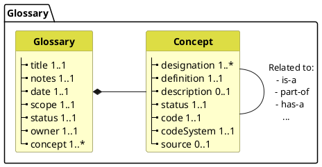

> This page is a description of how to use the metadata framework to describe Glossaries. For the glossary of terms used in describing the metadata framework, see the [glossary](glossary.html) page.
{: .info-box .should}

Managing common definitions of data across projects - and especially across different Member State implementations of the exchange format - requires common or comparable definitions. 

Using the metadata foundation for glossaries means the following requirements: 

* (conceptual) Definitions SHOULD be captured, independently of any specific data structure.
  * for example "name" which can be patient name, practitioner name.

* Elements in a data structure SHOULD be mapped to a definition

* Concept definitions SHALL support all their uses - i.e. the definition needs to be broad enough to support all the data elements that use and constrain the definition.
  * for example "real current name of a person" can be used in patient or practitioner but cannot be used in aliases or other fictitious names, nor can be used to capture name history

* Concepts can be more specific if needed - for example "patient name" may deserve its own place in a glossary, given its relevance.

...

### Metadata Requirements

Glossaries can be documented and with the following structured of machine-readable metadata:




### Implementation

Glossaries are implemented in FHIR as CodeSystems.

```json
{
  "code": "allergy",
  "display": "Allergy",
  "designation": [
    {
      "language": "en",
      "value": "Allergy" 
    }
  ],
  "definition": "Risk of harmful or undesirable physiological response which is specific to an individual and associated with exposure to a substance or other agent.",
  "description": "Allergies can manifest in different ways, including skin reactions, respiratory symptoms, or anaphylaxis. Common allergens include pollen, dust mites, certain foods, and medications."
}
```
